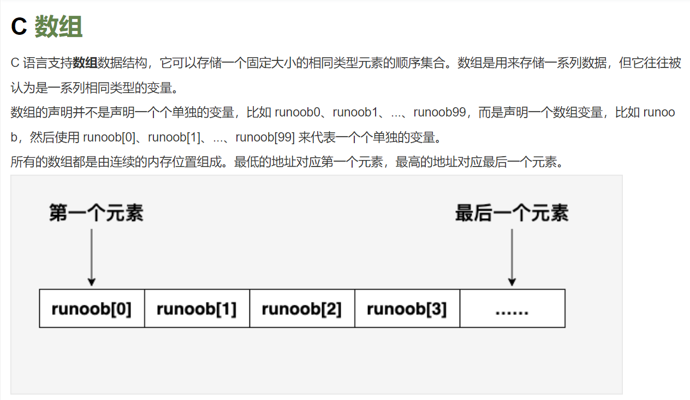
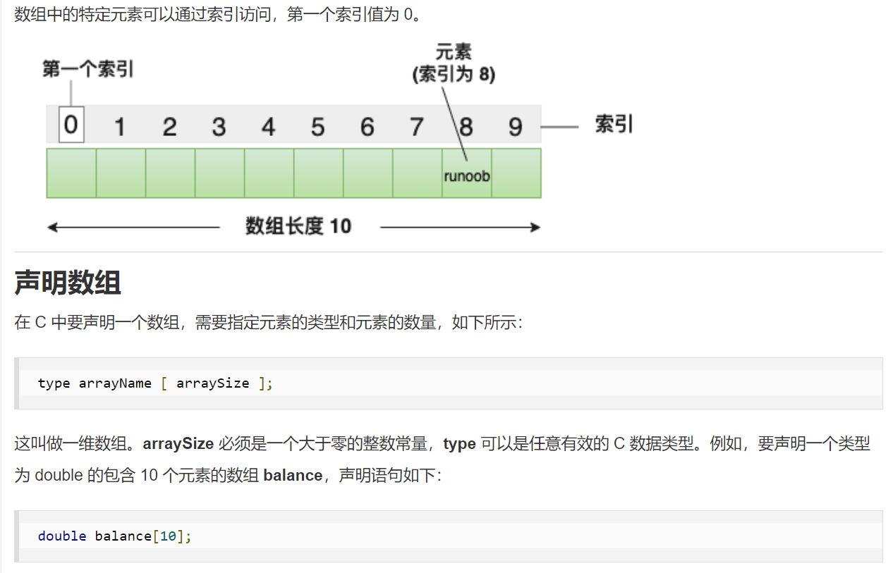
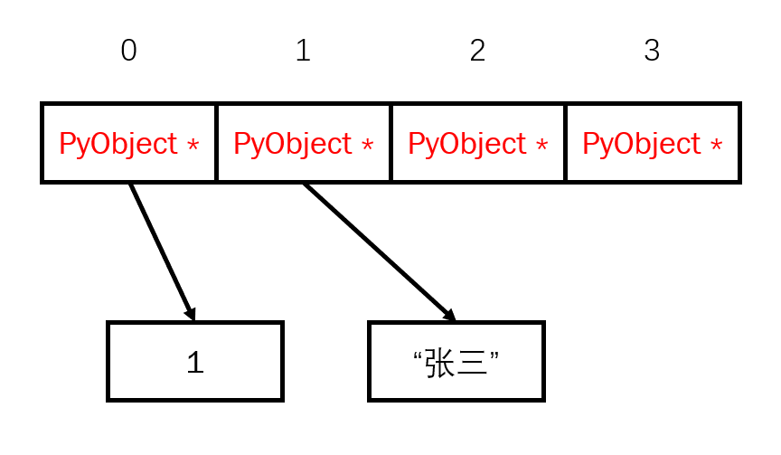
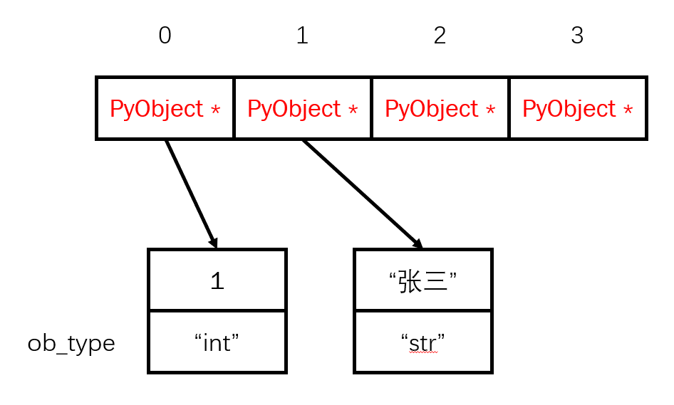
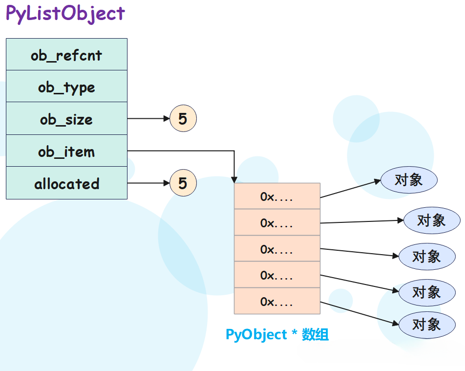
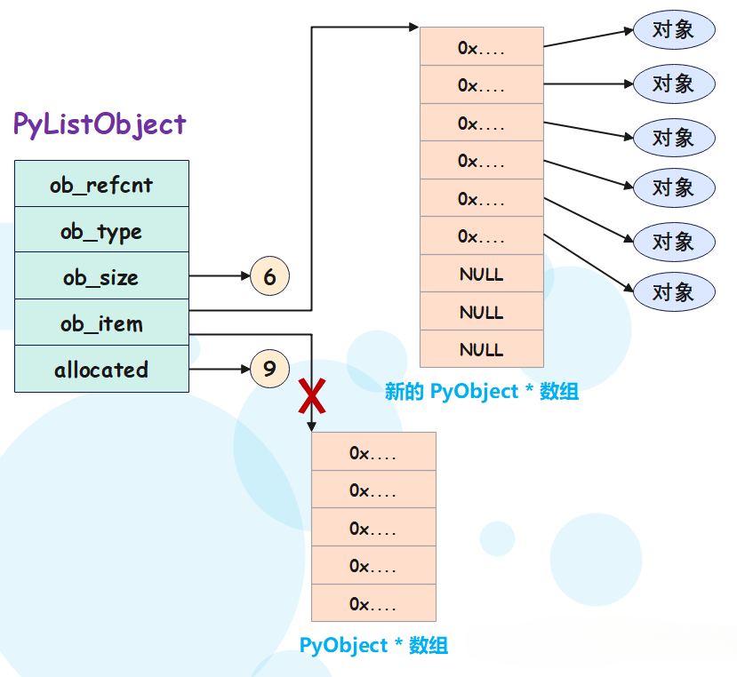

## 1. 为什么Python列表可以随便放任意类型的数据？
## 2. Python列表是如何自动扩容的？

 

 

 

 

## 源码的位置(带注释)
https://github.com/luke1879012/cpython/tree/py38_talk01

## PyListObject 在`Include\listobject.h`

## PyVarObject 在`Include\object.h`

## PyObject 在`Include\object.h`

## 提示：type都可以在object下面找到，直接跳转

## PyList_Type 在`Objects\listobject.c`

## append函数在`PyList_Type`的`list_methods`(tp_methods)

